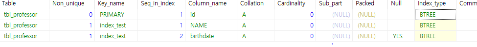
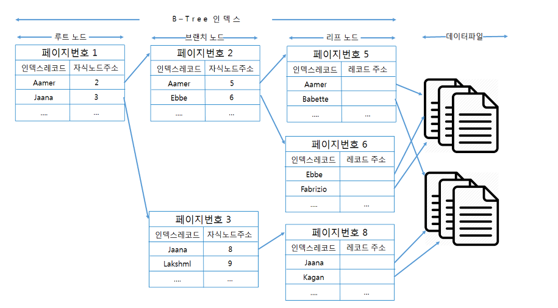
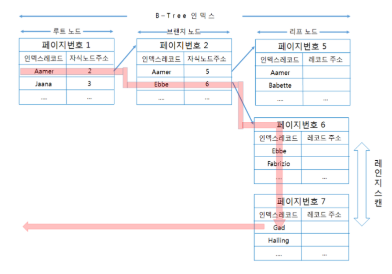
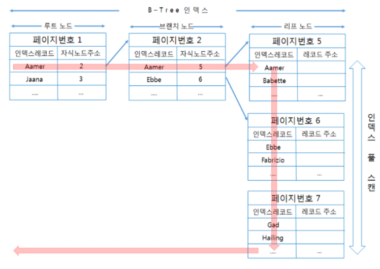
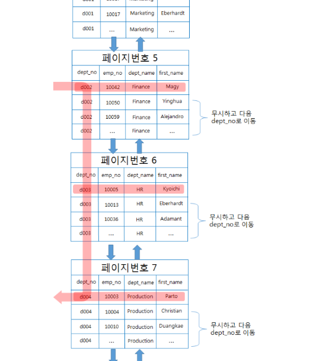
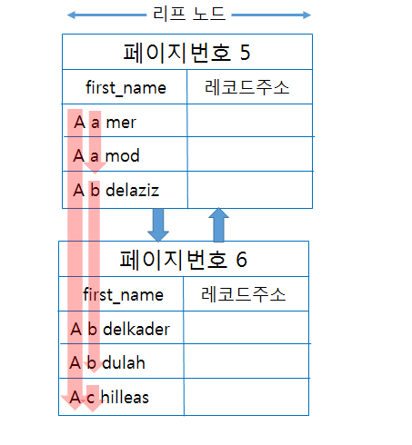
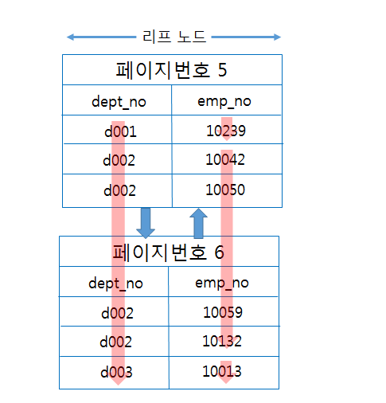

# B-Tree 인덱스

### B-Tree 인덱스

- MySQL에서 인덱스 구성 시 기본적으로 B-Tree 구조를 사용한다



### B-Tree의 구조



 출처 : [https://idea-sketch.tistory.com/43](https://idea-sketch.tistory.com/43)

- B-Tree의 구조는 Root 노드 , Branch 노드 , Leaf 노드로 구성되어 있다.
- Leaf 노드는 실제 데이터 레코드를 찾아가기 위한 **주소 값, Key 값을** 가지고 있다.

** 단 InnoDB 스토리지 엔진은 데이터를 레코드를 읽기 위해 PK를 저장하고 있는 B-Tree 를 한번 더 검색한다

### 인덱스를 왜 거는가?

- 인덱스의 핵심은 키 값이 정렬되어 있다는 것이다
- 인덱스 관리에는 레코드 추가 작업이 1이라면 대략 1.5의 비용이 소모 된다

이러한 비용을 감수하며 왜 인덱스를 거는 것일까?

> SELECT 의 효율을 높이기 위해 사용한다

```jsx
** 밑의 예시와 같이 UPDATE나 DELETE 를 처리하기 위해 항상 해당 레코드 먼저 검색시도 사용됨
UPDATE FROM t1 where mem_no = '12345'
DELETE FROM t1 where mem_no = '34567'
```

### 인덱스 Key 값의 크기 및 깊이

- 인덱스 페이지는 일반적으로 16KB이다
- DBMS의 B-Tree는 자식 노드의 개수가 가변적인 구조다
- 그렇다면 MySQL의 B-Tree는 자식 노드를 몇 개 까지 가질까?

> 이는 인덱스의 페이지 크기와 키 값의 크기에 따라 달라진다

** 인덱스를 구성하는 키 값의 크기가 커지면 느려지게 된다

** 인덱스를 구성하는 키 값의 크기가 커지면 인덱스 페이지가 담을 수 있는 인덱스 키 값의 개수가 적어져 B-Tree의 Depth가 깊어져 느려지게 된다

Index의 Key값을 작게 만드는 것이 효율적이다

### 인덱스의 선택도 *

- 선택도 ( 또는 카디널리티 ) 는 인덱스 키 값 중에 유니크한 값의 수를 의미한다
- 즉, 중복도와 반대의 개념으로 이해하자!

```jsx
ex ) 주민등록번호 : 중복도가 낮음 -> 카디널리티가 높음
```

- 인덱스는 카디널리티가 높을 수록 검색 대상이 줄어 들게 된다
    - 값이 Distinct 해야 최대한 많은 양의 데이터를 걸러 낼 수 있다
- 인덱스로 최대한 많은 양의 데이터를 걸러 내는 것이 효율적이다.  예를 들어 성별이 인덱스이면 남/녀 중에 하나기 때문에 50%만 거르지만 주민등록번호 같은 고유한 값은 대부분 거를 수 있다.

> 카디널리티가 높다 → 거를수 있는 데이터가 많다 → 검색 대상이 줄어든다

인덱스에서 유니크 한 값의 개수는 인덱스나 쿼리에 큰 효율을 미친다

### 인덱스를 타는 것이 항상 효율적일까?

- DBMS의 옵티마이저에서는 인덱스를 통해 레코드 1건을 읽는 것이 4~5배 더 많은 비용이 드는 작업으로 예측한다
    - 즉 전체 테이블 레코드의 20~25%를 넘어서면 인덱스를 이용하지 않고 테이블을 모두 직접 읽고 필터링 하는 것이 효율적이다.

### B-Tree 인덱스를 이용한 데이터 읽기 *

1. **인덱스 레인지 스캔**
    - 가장 대표적인 빠른 방법 이다
    - 검색해야 할 인덱스의 범위가 결정되었을때 사용하는 방식이다
    - 인덱스의 리프 노드에서 검색 조건에 일치하는 건들은 데이터 파일에서 레코드를 읽어오는
    과정이 필요하다

    > 이 과정마다 한건 한건 단위로 랜덤 I/O가 발생하게 되기 때문에 인덱스를 통해 데이터 레코드를 20~25%를 넘으면 전체 데이터를 읽고 필터링 하는것이 빠르다

    

    출처 : [https://velog.io/@mu1616/데이터베이스-인덱스-Index](https://velog.io/@mu1616/%EB%8D%B0%EC%9D%B4%ED%84%B0%EB%B2%A0%EC%9D%B4%EC%8A%A4-%EC%9D%B8%EB%8D%B1%EC%8A%A4-Index)

2. **인덱스 풀 스캔**
    - 인덱스의 처음부터 끝 까지 모두 읽는 방식을 인덱스 풀스캔 이라고 한다
    - 쿼리의 조건절에 사용된 컬럼이 인덱스의 첫번째 컬럼이 아닌 경우 사용된다
    - 인덱스 레인지 스캔보다 빠르진 않지만 테이블 풀 스캔보다 적은 디스크 I/O로 쿼리를 처리 할 수 있다.

    ** 이는 인덱스를 효율적으로 사용하지 못한 것이다.

    

3. **루스 인덱스 스캔**
    - 느슨하게 또는 듬성듬성 인덱스를 읽는 것을 의미한다
    - 인덱스 레인지 스캔과 비슷하게 작동하지만 중간에 필요하지 않은 인덱스는 무시한다.
    - group by, max 사용시 범위 전체를 다 스캔 할 필요가 없을 시 옵티마이저가 읽어 들인다.

    

    1. **인덱스 스킵 스캔**
    - 밑의 쿼리와 같이 첫번째 인덱스 컬럼을 타지 않으면 인덱스를 타지 않게 된다
    - 이를 위해 MySQL 8.0 버전에서 인덱스 스킵 스캔이 도입되었다.

    ```jsx
    ALTER TABLE employees 
    	ADD INDEX ix_gender_birthdate(gender , birth_date);

    // 인덱스 사용하지 못하는 쿼리
    SELECT * FROM employees WHERE birth_date >= '1965-02-01';

    // 인덱스 사용가능한 쿼리
    SELECT * FROM employees WHERE gender = 'M' and birthdate >='1965-02-01';
    ```

    **  type : range → 꼭 필요한 부분만 참조해서 읽었다
                  : all →  테이블 풀 스캔

            : ref → 테이블의 일부 대상으로 읽어들임

### 인덱스 정렬 및 스캔 방향

- 인덱스는 생성 시점에 오름차순 또는 내림 차순으로 정렬되지만 쿼리가 그 인덱스를 사용하는 시점에 인덱스를 읽는 방향에 따라 오름차순 또는 내림차순 정렬 효과를 얻을 수 있다.
- MySQL의 옵티마이저는 인덱스의 읽기 방향을 전환해 실행계획을 만들어 낸다

- 인덱스 정렬
    - 오름차순 인덱스 : 작은 값의 인덱스 키가 B-Tree의 왼쪽에 정렬된 인덱스
    - 내림차순 인덱스 : 큰 값의 인덱스 키가 B-Tree의 오른쪽에 정렬된 인덱스
    - 인덱스 정순 스캔 : 인덱스 리프노드의 왼쪽부터 오른쪽으로 스캔
    - 인덱스 역순 스캔 : 인덱스 리프노드의 오른쪽에서 왼쪽으로 스캔

> 일반적으로 역순 정렬 쿼리가 정순 정렬 쿼리보다 시간이 많이 걸린다.

- 이유 1 : 페이지 잠금이 인덱스 정순 스캔에 적합한 구조
- 이유 2 : 페이지 내에서 인덱스 레코드가 단방향으로만 연결된 구조

### B-Tree 인덱스의 가용성과 효율성 ***

- 쿼리 최적화와 인덱스 가용성에 대해 알아보자

**비교조건의 종류와 효율성**

- B-Tree 인덱스의 특징은 왼쪽 값에 기준해서 오른쪽 값이 정렬되어 있는 것이다
    - 하나의 컬럼으로 검색해도 값의 왼쪽 부분이 없으면 인덱스 레인지 스캔 X
    - 다중 컬럼 인덱스에서 왼쪽 컬럼의 값을 모르면 인덱스 레인지 스캔 X

- CASE A : first_name
- 이 경우에는 인덱스 레인지 스캔 방식으로 인덱스를 이용할 수 없다.

```jsx
SELECT * FROM employees where first_name like '%mer';
```



- first_name 컬럼에 지정된 값의 왼쪽부터 한글자씩 비교해가면서 일치하는 레코드를 찾아야 하는데 조건절에는 왼쪽 부분이 고정되어 있지 않기 때문이다

- CASE B : dept_no + emp_no

```jsx
SELECT * FROM dept_emp WHERE emp_no >= 10114;
```

- 인덱스가 컬럼 순서대로 생성되 있다면 인덱스의 선행 컬럼인 dept_no 없이 emp_no 값으로만 검색하면 인덱스를 효율적으로 사용할 수 없다.

    

### 인덱스를 효율적으로 사용하지 못하는 경우

- 인덱스로 사용한 컬럼 값 그대로 사용해야만 인덱스가 사용된다
    - 인덱스의 컬럼절을 변형하면 안된다

    ```jsx
    /* 인덱스를 타지 않는 예 */
    SELECT column_name FROM table_name WHERE TO_CHAR(column_name, 'YYYYMMDD') = '20130909';

    /* 인덱스를 타는 예 */
    SELECT column_name FROM table_name WHERE column_name = TO_DATE('20130909', 'YYYYMMDD');
    ```

- LIKE 연산자를 사용한 경우

    ```jsx

    /* 인덱스를 타지 않는 예 */
    SELECT column_name FROM table_name WHERE column_name LIKE '%S%';
    SELECT column_name FROM table_name WHERE column_name LIKE '%S';

    /* 인덱스를 타는 예 */
    SELECT column_name FROM table_name WHERE column_name LIKE 'S%';
    ```

- 내부적으로 데이터 형 변환이 일어난 경우
    - 서로 대입되는 항목끼리 데이터 타입이 다르면 내부적인 형 변환에 의해 컬럼이 함수를 사용한 효과를 낸다.

    ```jsx
    /* 인덱스를 타지 않는 예  DATE 타입의 column */
    SELECT column_name FROM table_name WHERE column_name  = '20130909'; 

    /* 인덱스를 타는 예 */
    SELECT column_name FROM table_name WHERE column_name = TO_DATE('20130909', 'YYYYMMDD');
    ```

- 조건절에 NULL 또는 NOT NULL을 사용하는 경우

    ```jsx
    /* 인덱스를 타지 않는 예 */
    SELECT FROM table_name WHERE column_name IS NULL;
    SELECT column_name FROM table_name WHERE column_name IS NOT NULL;

    /* 인덱스를 타는 예 */
    SELECT column_name FROM table_name WHERE column_name > '';
    SELECT column_name FROM table_name WHERE column_name >= 0;
    ```

- 부정형으로 조건을 사용한 경우

    ```jsx
    /* 인덱스를 타지 않는 예 */
    SELECT column_name FROM table_name WHERE column_name != 30;

    /* 인덱스를 타는 예 */
    SELECT column_name FROM table_name WHERE column_name < 30 AND column_name > 30;
    SELECT column_name FROM table_name WHERE NOT EXISTS (SELECT column_name FROM table_name WHERE column_name = 30);
    ```

- OR 조건을 사용하는 경우
    - OR 연산자는 비교해야할 ROW가 늘어나 풀 스캔이 발생활 확률이 높다.

    ```jsx
    /* 인덱스를 타지 않는 예 */
    SELECT * FROM table_name  WHERE column_name = 'yunseop' or name = 'song';

    /* 인덱스를 타는 예 */
    SELECT * FROM table_name  WHERE column_name = 'yunseop';
    UNION ALL 
    SELECT * FROM table_name  WHERE column_name = 'song';
    ```

**Reference**

- Real MySQL
- [https://hjjungdev.tistory.com/115](https://hjjungdev.tistory.com/115)
- [https://idea-sketch.tistory.com/43](https://idea-sketch.tistory.com/43)
- [https://jojoldu.tistory.com/243](https://jojoldu.tistory.com/243)