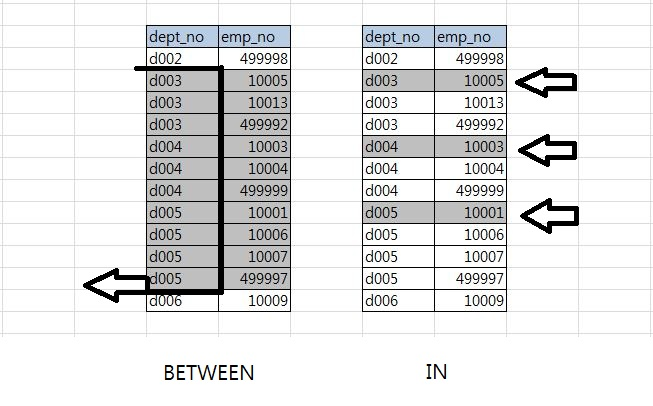

# 쿼리 작성 및 최적화 (MySQL 연산자와 내장 함수)

> 내용이 굉장히 방대하기 때문에 필수적이고 중요한 내용만 간추려
정리한다
> 

## 11.1 쿼리 작성과 연관된 시스템 변수

- MySQL 서버의 `sql_mode` 를 사용해서 시스템 변수를 설정할 수 있다
    - 데이터가 적재 되고 서비스 운영 중인 DB의 경우에는 `sql_mode` 의 
    시스템 변수를 바꾸지 않는 것이 좋다
    - MySQL 서버 환경에 익숙하지 않으면 특별한 경우가 아니라면 기
    본값을 그대로 사용하자

### 11.1.2 영문 대소문자 구분

- MySQL 서버는 설치된 OS에 따라 테이블 명의 대소문자를 구분 한다
    - 윈도우 에서 MySQL은 대소문자를 구분하지 않지만 Unix 계열의 운영
    체제에서는 대소문자를 구분한다
    - 대소문자 구분의 영향을 받지 않게 하려면 `lower_case_table_names` 변수를 조정하자
    - 특별한 경우가 아니라면 초기 DB나 테이블 생성 시에 대문자 또는 소문자로 통일하여 사용하도록 하자

### 11.1.3 MySQL 예약어

- 테이블을 생성할 때는 항상 역따옴표로 테이블이나 컬럼의 이름을 둘러싸지 않은 상태로 생성하자
    - 그래야만 MySQL 예약어 인지 아닌지를 서버가 에러로 알려준다

## 11.3 MySQL 연산자와 내장 함수

- 가급적 SQL의 가독성을 높이기 위해 ANSI 표준 형태의 연산자를 사용 하자

### 11.3.1 리터럴 표기법 문자열

- SQL 표준에서 문자열은 홑 따옴표 (’) 를 사용해서 표시 한다
- SQL에서 사용되는 식별자가 키워드와 충돌할 때 오라클이나 PostgreSQL 은 
쌍따옴표나 대괄호로 감싸 충돌을 피한다. MySQL 에서는 역 따옴표(`) 로 감싸 예약어와의 충돌을 피할 수 있다

```sql
예시 :
CREATE TABLE tab_test (`table` varhcar(20) not null, ... );
SELECT `column` FROM tab_test;
```

- 그러나 가급적 역 따옴표 (`) 를 사용하는 것을 지양하는 편이 좋다

### 11.3.2 숫자

- 숫자 값을 상수로 SQL에 사용할 때 따옴표 (’ , “ ) 없이 숫자 값을 입력한다
- 문자열 형태로 따옴표를 사용하더라도 비교 대상이 숫자 값이 거나 숫자 타입의 컬럼이면 MySQL 서버가 문자열 값을 숫자 값으로 자동 형 변환 한다
- MySQL은 숫자 타입과 문자열 타입 간의 비교에서 숫자 타입을 우선시 한다
    - 숫자 값은 숫자 타입의 컬럼에만 저장하도록 하자. 컬럼 타입이 달라
    인덱스가 타지 않는 현상이 발생할 수 있다

### 11.3.1.3 날짜

- 정해진 형태의 날짜 포맷으로 표기하면 MySQL 서버가 자동으로 DATE, DATETIME 값으로 변환해서 사용 한다

```sql
SELECT * FROM dept_emp WHERE from_date = '2011-04-19';
SELECT * FROM dept_emp WHERE from_date = STR_TO_DATE('2011-04-19','%Y-%m-%d');

// 위의 두 커리는 차이점이 없다
```

- 첫 번째 쿼리와 같이 비교한다고 해서 from_date 컬럼의 값을 문자열로 변환해서 비교하지 않기 때문에 인덱스를 이용하는데 문제는 없다

## 11.3.2 MySQL 연산자

### 11.3.2.1 동등 비교 및 부정,NOT 연산자

- MySQL 에서는 동등 비교를 위해 `<=>` 연산자를 제공 한다
    - Null-safe 비교 연산자 이며 = 연산자와 같으며 부가적 으로 NULL 값에
    대한 비교까지 수행 한다
- 부정 연산자는 `<>` , `!=` 를 주로 사용하고 NOT 연산자는 `NOT` , `!` 를 사용 한다

### 11.3.2.4 AND(&&) 와 OR(||) 연산자

- 일반적인 DBMS 에서는 AND와 OR 연산자를 사용 한다
- MySQL 에서는 `&&` 와 `||` 의 사용도 허용 한다
    - SQL의 가독성을 높이기 위해 다른 용도로 사용될 수 있는 `&&` 와 `||` 
    연산자는 사용을 지양하도록 하자
    
     (PostgreSQL) 에서도 지원하지 않음
    

### 11.3.2.6 REGEXP 연산자

- RLIKE는 오른쪽 일치용 연산자가 아닌 정규 표현식을 비교하는 연산자이다
- `REGEXP` 연산자를 문자열 컬럼 비교에 사용할 때 `REGEXP` 조건의 비교는 인덱스 레인지 스캔을 사용 할 수 없다

### 11.3.2.7 LIKE 연산자

- LIKE 에서 사용하는 와일드 카드 문자는 `%,_`
    - % : 0 또는 1개 이상의 모든 문자에 일치 (문자의 내용과 관계 없이)
    - _  : 정확히 1개의 문자에 일치 (문자의 내용과 관계 없이)
- 와일드카드의 위치에 따라 인덱스를 탈 수도 안 탈 수도 있다
    - MySQL, PostgreSQL 모두 B-tree Index를 사용하기 때문에 발생하는 일

```sql
// 인덱스 탐
SELECT COUNT(*)
FROM employees
WHERE first_name LIKE 'Christ%';

// 인덱스 안탐
SELECT COUNT(*)
FROM employees
WHERE first_name LIKE '%rist';
```

- PostgreSQL 도 b-Tree index가 default 이기 때문에 mysql 과 index 튜닝 전략은 비슷하다고 간주해도 된다

### 11.3.2.8 Between 연산자

- `Between` 연산자는 크거나 같다 , 작거나 같다 라는 두 개의 연산자를 하나로 합친 것
- `Between` 연산자를 사용할 경우 선형으로 인덱스를 검색하게 된다
    - 상당히 많은 레코드를 읽는 상황이 발생 할 수 있다



- `IN` 연산자의 처리 방법은 동등 비교(=) 연산자와 비슷 하다
    - 여러 개의 동등 비교(=) 를 하나로 묶은 것과 같은 연산자
- 여러 컬럼으로 인덱스가 만들어져 있을 때, 인덱스 앞 쪽에 있는 컬럼의 선택도가 떨어질 때 `IN` 으로 변경하여 쿼리의 성능을 개선할 수 있다

### 11.3.2.9 IN 연산자

- `IN` 은 여러 개의 값에 대해 동등 비교 연산을 수행 한다
- 여러 개의 값이 비교 되지만 범위로 검색 하는 것이 아니라 여러 번의 동등 비교로 실행 하기 때문에 비교적 빠르다

## 11.3.3 MySQL 내장 함수

- 기본적인 SQL 함수는 동일하게 제공 되지만 함수의 이름이나 사용법은 DBMS에 따라 다를 수 있다

### 11.3.3.1 NULL 값 비교 및 대체

- `IFNULL()` : 컬럼이나 표현식의 값이 NULL 인지 비교하고 NULL 이면 다른 값으로 대체하는 용도로 사용 한다
- `ISNULL()` : 인자로 전달한 표현식이나 컬럼이 NULL인지 아닌지 비교 한다
    - NULL 이면 TRUE(1) , NULL이 아니면 FALSE(0)을 반환 한다

### 11.3.3.2 현재 시각 조회 (NOW, SYSDATE)

- 두 함수 모두 현재의 시간을 반환하는 함수이다
- 하나의 SQL 에서 모든 NOW() 함수는 같은 값을 가지지만 SYSDATE() 함수는
하나의 SQL 내에서도 호출 되는 시점에 따라 결과 값이 달라 진다

> SYSDATE() 함수는 함수가 호출 될 때마다 다른 값을 반환하므로 상수가 아니다. 레플리카 서버에서 안정적으로 복제 되지 못하며 인덱스를 효율적으로 사용하지 못할 가능성이 있기에 가급적 NOW() 를 사용하자
> 

### 11.3.3.3 날짜와 시간의 포맷 (DATE_FORMAT, STR_TO_DATE)

- DATE 타입의 컬럼이나 값을 문자열로 변환 시 `DATE_FORMAT()` 함수를 사용 한다
    - PostgreSQL 에서는 `to_char` , `to_date` 를 사용 한다
- 날짜 포맷 변경을 위한 지정자는 모두 대소문자를 구분해서 사용해야 한다

### 11.3.3.7 문자열 결합 (Concat)

- 여러 개의 문자열을 연결 해서 하나의 문자열로 반환하는 함수 이다
    - PostgreSQL도 concat을 그대로 사용 한다
- `CONCAT_WS` 는 각 문자열을 연결할 때 구분자를 넣어 준다

```sql
SELECT CONCAT_WS(',','Geunho','Hong') AS name;
결과 : Geunho,Hong
```

### 11.3.3.8 Group by 문자열 결합 (Group_concat)

- 주로 Group by와 함께 사용하며 group y가 없는 SQL에서 사용하면 단 하나의 결과 값만 만들어 낸다

```sql
SELECT GROUP_CONCAT(dept_no) FROM departments;

결과 : d009,d008,d007 .....
```

- `GROUP_CONCAT(dept_no SEPARATOR '|')` 와 같이 사용하여 구분자를 지정할 수 도 있다
- 지정한 컬럼의 값을 연결하기 위해 제한적인 메모리 버퍼 공간을 사용한다. 따라서 GROUP_CONCAT의 결과가 지정된 버퍼 크기를 초과하지 않게 주의해야 한다
    - PostgreSQL의 경우 String_agg 를 사용하는 듯 하다

### 11.3.39 값의 비교와 대체 (CASE WHEN ... THEN ... END)

- CASE WHEN은 함수가 아닌 SQL 구문 이다

```sql
사용 예시
SELECT emp_no, first_name
  CAST gender WHEN 'M' THEN 'Man'
              WHEN 'F' THEN 'Woman'
              ELSE 'Unknown' END AS gender
FROM employees
LIMIT 10;
```

- 위와 같이 사용하여 switch 문 형태로 쿼리를 처리 할 수 있다

### 11.3.3.10 타입의 변환 (CAST, CONVERT)

- PreparedStatment를 제외하면 SQL은 텍스트 기반으로 작동해 모든 입력값은 문자열로 취급 된다
- `CAST()` 함수를 사용하여 데이터 타입을 변환 할 수 있다

### 11.3.3.12 암호화 및 해시 함수 (MD5, SHA , SHA2 )

- MD5와 SHA 모두 비 대칭형 암호화 알고리즘 이며 인자로 전달한 문자열을 
각각 지정된 비트 수의 해시 값을 만들어 내는 함수이다
- 비밀번호와 같은 암호화 값이 필요한 경우 주로 사용한다

```sql
SELECT MD5('abc')
결과 : 9001508213acsdji103 .....

SELECT SHA('abc')
결과 : a993wjdiwndlfidndqe.....
```

- MD5() 함수는 입력된 문자열의 길이를 줄이는(Digest) 용도로 사용되기도 한다

### 11.3.3.13 처리 대기 , 벤치 마크

- “쿼리 실행 도중 멈춰서 대기하는 기능” 인 SLEEP() 함수가 있다
- 디버깅이나 테스트 용으로 주로 사용 된다
    - PostgreSQL은 pgsleep을 사용한다
- `BENCHMARK()` 함수는 함수의 성능 테스트 용으로 주로 사용된다
    - 그러나 `BENCHMARK` 횟수와 관계 없이 단 1번의 네트워크 , 쿼리 파싱 및 최적화가 일어나기 때문에 실제 성능과는 큰 차이가 있다
    - 두 개의 동일 기능을 상대적으로 비교 분석하는 용도로만 사용하자
    

### 11.3.3.15 IP 주소 변환 (INET_ATON , INET_NTOA)

- IP 주소는 4바이트의 부호 없는 정수 이다
- 문자열로 저장된 IP 주소는 저장 공간을 훨씬 많이 필요로 한다
- MySQL 에서는 `INET_ATON()` , `INET_NTOA()` 함수를 이용해 IPv4 주소를 문자열이 아닌 부호 없는 정수 타입에 저장할 수 있다
    - `INET_ATON()` : 문자열로 구성된 IPv4 주소를 정수형으로 변환
    - `INET_NTOA()` : 정수형의 IPv4 주소를 사람이 읽을 수 있는 형태의 ‘.’ 로 구분된 문자열로 변환

### 11.3.3.16 JSON Format

- MySQL 클라이언트 에서 JSON 데이터를 표시 할 수 있다
- `JSON_PRETTY` , `JSON_EXTRACT` ... 등의 다양한 함수가 존재한다 필요한 경우
검색해서 사용하도록 하자