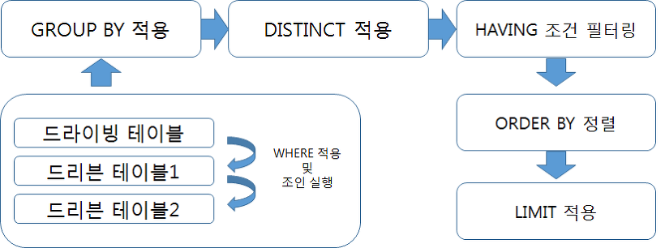
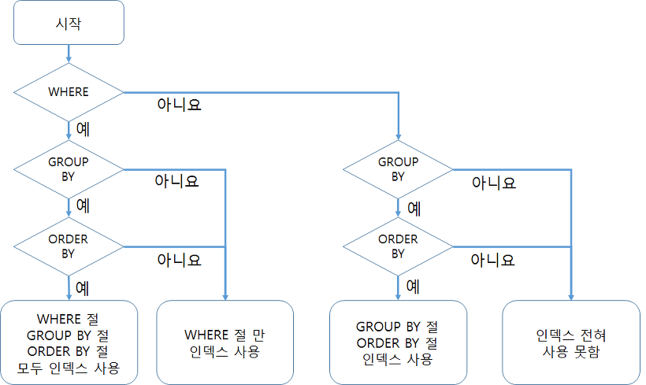

# 쿼리 작성 및 최적화 (SELECT)

## 11.4 SELECT

### 11.4.1 SELECT 절의 처리 순서



> 문법 순서
> 
> 1. SELECT
> 2. FROM
> 3. WHERE
> 4. GROUP BY
> 5. ORDER BY

---

> 실제 실행 순서
> 
> 1. FROM
> 2. WHERE
> 3. GROUP BY
> 4. HAVING
> 5. SELECT
> 6. ORDER BY

---

- 서브쿼리로 작성된 인라인 뷰의 경우 쿼리 실행 순서가 달라질 수 있다

## 11.4.2 WHERE 절과 GROUP BY 절, ORDER BY 절의 인덱스 사용

### 11.4.2.1 인덱스를 사용하기 위한 기본 규칙

- `WHERE` , `ORDER BY` , `GROUP BY` 가 인덱스를 사용하려면 인덱스 된 컬럼의 값 자체를 변환하지 않고 그대로 사용해야 한다

```sql
// case1) 인덱스 안탐
SELECT * FROM salaries WHERE salary * 10 > 150000;

// case2) 인덱스 탐
SELECT * FROM salaries WHERE salary > 150000/10;
```

- type이 `ref` , `range` 이면 인덱스 적절하게 탐
- type이 `index` 면 인덱스 풀 스캔을 의미

> SQL을 작성할 때 데이터의 타입에 맞춰 비교 조건을 작성하자. data type 을 함부로 변경할 경우 Index를 타지 않을 수 있다
> 

### 11.4.2.2 WHERE절의 인덱스 사용

- WHERE 조건절에 나열된 순서가 인덱스와 다르더라도 MySQL 서버 옵티마이저는 인덱스를 사용할 수 있는 조건들을 뽑아 최적화 할 수 있다
- GROUP BY , ORDER BY 와 달리 WHERE 절에서의 각 조건이 명시된 순서는 중요치 않고 인덱스를 구성하는 컬럼에 대한 조건이 있는지 없는지가 중요하다

> 인덱스 컬럼 순서 : COL_1 , COL_2 , COL_3 , COL_4
> 

> WHERE 조건 컬럼 순서 : COL_2 , COL_3, COL_1, COL_4
> 
- 위와 같이 사용하여도 최적화가 가능 하다
- 그러나 각 조건이 `OR` 연산자로 연결되면 비교해야 할 레코드의 건수가 늘어나기 때문에 WHERE 조건에 `OR` 연산자가 있다면 주의하도록 하자

### 11.4.2.3 GROUP BY 절의 인덱스 사용

- GROUP BY 절에 명시된 컬럼의 순서가 인덱스를 구성하는 컬럼의 순서와 같으면 GROUP BY 절은 인덱스를 사용할 수 있다
- 인덱스를 구성하는 컬럼 중 뒤쪽에 있는 컬럼은 GROUP BY 절에 명시되지 않아도 인덱스를 사용할 수 있지만 앞쪽에 있는 컬럼은 GROUP BY 절에 명시되지 않으면 인덱스를 사용할 수 없다
- WHERE 조건절과는 달리 GROUP BY 절에 명시된 컬럼이 하나라도 인덱스에 없으면 인덱스를 이용할 수 없다

> **예시**
> 
> 1. GROUP BY COL_2 , COL_1
>     1. 인덱스를 구성하는 컬럼의 순서와 일치하지 않아 사용 못함
> 2. GROUP BY COL_1, COL_3
>     1. COL_3가 명시 되었지만 COL_2가 앞에 명시되지 않아 사용 불가
> 3. GROUP BY COL_1,COL_2,COL_3,COL_4,COL_5
>     1. COL_5 가 인덱스에 없어 인덱스 사용 불가능

### 11.4.2.4 ORDER BY 절의 인덱스 사용

- ORDER BY 절의 인덱스 사용 여부는 GROUP BY 요건과 비슷하다
- 단, ORDER BY의 경우 정렬되는 각 컬럼의 오름차순, 내림차순 옵션이 인덱스와 같거나 정반대인 경우만 사용 가능 하다

> MySQL의 인덱스는 모든 컬럼이 오름 차순으로 정렬 되어 있다 (B-tree)
> 

> **예시**
> 
> 1. ORDER BY COL_2, COL_3
>     1. 인덱스의 제일 앞 쪽 컬럼인 COL_1이 명시되지 않아 인덱스 사용 불가
> 2. ORDER BY COL1, COL3, COL_2
>     1. 인덱스와 ORDER BY 절의 컬럼 순서가 일치하지 않아 인덱스 사용 불가
> 3. ORDER BY COL_1 , COL_2 DESC , COL_3
>     1. 다른 컬럼은 모두 오름차순 인데 COL_2 정렬 순서가 내림 차순 이라 인덱스 사용 불가

### 11.4.2.5 WHERE 조건과 ORDER BY(또는 GROUP BY) 절의 인덱스 사용

- WHERE 절과 ORDER BY 절이 동시에 같은 인덱스 사용
    - WHERE 절의 비교 조건에 사용하는 컬럼과 ORDER BY 절의 정렬 대상 컬럼이 모두 하나의 인덱스에 연속되서 포함되어 있을 때 이 방식으로 인덱스를 처리 한다
    - 나머지 2가지 방법 보다 훨씬 빠른 성능을 보이기 때문에 가능하면 이 방식으로 쿼리를 튜닝하고 인덱스를 생성하자
- WHERE 절만 인덱스 이용
    - ORDER BY 절은 인덱스를 이용한 정렬이 불가능 하며 인덱스를 통해 검색된 결과 레코드를 별도의 정렬 처리 과정 (Using Filesort)를 거쳐 정렬을 수행한다.
    - 주로 이 방법은 WHERE 절의 조건에 일치하는 레코드 건수가 많지 않을 때 효율적이다
- ORDER BY 절만 인덱스 이용
    - ORDER BY 절은 인덱스를 이용해 처리하지만 WHERE 절은 인덱스를 이용하지 못한다
    - 이 방식은 ORDER BY 절의 순서대로 인덱스를 읽으면서 레코드 한 건씩 WHERE 절의 조건에 일치하는지 비교하고 일치하지 않을 때 버리는 형태로 사용 한다
    - 아주 많은 레코드를 조회해서 정렬할 때 이런 형태로 튜닝 한다

> 또한, WHERE 절에서 동등 비교 조건으로 비교된 컬럼과 ORDER BY 절에 명시된 컬럼이 순서대로 빠짐 없이 인덱스 컬럼의 왼쪽부터 일치해야 한다
> 

> 중간에 빠지는 컬럼이 있으면 WHERE 절과 ORDER BY 절 모두 인덱스를 사용할 수 없다
> 
> 
> > 이 경우에는 WHERE 절만 인덱스를 이용할 수 있다
> > 

### 11.4.2.6 GROUP BY 절과 ORDER BY 절의 인덱스 사용

- GROUP BY와 ORDER BY 절이 동시에 사용된 쿼리 에서 두 절이 모두 하나의 인덱스를 사용해서 처리 되려면 GROUP BY 절에 명시된 컬럼과 ORDER BY에 명시된 컬럼의 순서와 내용이 모두 같아야 한다
- 둘 중 하나라도 인덱스를 이용할 수 없으면 둘 다 인덱스를 사용하지 못한다
    - 즉 GROUP BY는 인덱스를 이용할 수 있지만 ORDER BY 가 인덱스를 이용할 수 없으면 모두 인덱스를 이용하지 못한다
    

### 11.4.2.7 WHERE 조건과 ORDER BY 절, GROUP BY 절의 인덱스 사용



### 11.4.3 WHERE 절의 비교 조건 사용 시 주의 사항

### 11.4.3.1 NULL 비교

- 컬럼의 값이 NULL인지 확인하기 위해 ISNULL() 함수를 사용 한다. 그러나 인덱스를 적절하게 타지 못할 경우가 발생할 수 있으므로 `IS NULL` 연산자를 사용 하자

### 11.4.3.2 문자열이나 숫자 비교

- 문자열 컬럼 이나 숫자 컬럼을 비교할 때 반드시 그 타입에 맞는 상숫값을 사용 하자
    - 문자열 컬럼이면 문자열 리터럴 사용
    - 숫자 타입이면 숫자 리터럴 사용

> 위 규칙을 지켜야 인덱스를 타지 못할 경우를 방지할 수 있다
> 

### 11.4.3.3 날짜 비교

### 11.4.3.3.1 DATE 또는 DATETIME과 문자열 비교

- 컬럼의 타입이 DATE나 DATETIME 타입 이면 별도로 문자열을 DATE나 DATETIME 타입으로 명시적으로 변환하지 않아도 MySQL이 내부적으로 변환을 수행 한다
    - 테스트 결과 PostgreSQL 도 내부적으로 형 변환 이루어짐

```sql
SELECT COUNT(*)
FROM employees
WHERE hire_date > STR_TO_DATE('2011-07-23','%Y-%m-%d');

SELECT COUNT(*)
FROM employees
WHERE hire_date > '2011-07-23';

// 위의 두 쿼리는 결과적으로 동일 하다
```

- 가능하면 DATE나 DATETIME 타입의 컬럼을 변경하지 말고 상수를 변경하는 형태로 조건을 사용 하자

```sql
// 이 쿼리는 인덱스 컬럼 타입을 빼거나 더하기 때문에 인덱스를 타지 않는다
SELECT COUNT(*)
FROM employees
WHERE DATE_ADD(hire_date , INTERVAL 1 YEAR) > '2011-07-23';

// 이렇게 사용하자
SELECT COUNT(*)
FROM employees
WHERE hire_date > DATE_SUB('2011-07-23', INTERVAL 1 YEAR);
```

### 11.4.3.3.2 DATE와 DATETIME의 비교

- DATETIME과 DATE 타입의 비교에서 타입 변환은 인덱스의 사용 여부에 영향을 미치지 않기 때문에 성능보다는 쿼리의 결과에 주의해서 사용 하자

### 11.4.3.3.3 DATETIME과 TIMESTAMP의 비교

- 컬럼이 DATETIME 타입 이라면 `FROM_UNIXTIME()` 함수를 이용해 TIMESTAMP 값을 DATETIME 타입으로 만들어 비교해야 한다
- 반대로 컬럼의 타입이 TIMESTAMP 타입 이라면 `UNIX_TIMESTAMP()` 함수를 이용해 DATETIME 을 TIMESTAMP로 변환해 비교해야 한다
    - 또는 간단하게 NOW() 함수를 사용 하자

### 11.4.3.4 Short-Circuit Evaluation

- 선행 표현식의 결과에 따라 후행 표현식을 평가할지 말지 결정하는 최적화를 `Short-circuit Evaluation` 이라 한다
- MySQL 서버는 쿼리의 WHERE 절에 나열된 조건을 순서대로 `Short-circuit Evaluation` 방식으로 평가한다
    - 그러나 인덱스를 사용할 수 있는 조건이 있다면 그 조건을 최우선으로 사용 한다
- MySQL 서버에서 쿼리를 작성할 때 복잡한 연산 이나 다른 테이블의 레코드를 읽어야 하는 서브쿼리 조건 등은 WHERE 절 뒤쪽으로 배치하는 것이 성능상 도움이 된다
    - 단 인덱스를 사용할 수 있는 조건은 WHERE 절의 어느 위치에 나열되든지 순서에 관계없이 먼저 사용된다

### 11.4.4 Distinct

- 특정 컬럼의 유니크한 값을 조회하려면 SELECT 쿼리에 DISTINCT를 사용 한다
- DISTINCT를 남용하면 성능 및 쿼리 결과가 달라 질 수 있으므로 주의해서 사용 해야 한다
    - 9.2.5 DISTINCT 처리 참고

### 11.4.5 Limit n

- `LIMIT` 은 지정된 순서에 위치한 레코드만 가져오고자 할 때 사용 한다
- WHERE 조건이 아니기 때문에 항상 쿼리의 가장 마지막에 실행 된다

```sql
SELECT * FROM employees LIMIT 0, 10;
SELECT * FROM employees GROUP BY first_name LIMIT 0,10;
SELECT DISTINCT first_name FROM employees LIMIT 0,10; 

```

- 첫번째 쿼리는 LIMIT 조건이 없으면 테이블 풀 스캔을 한다. 정렬이나 그루핑 , DISTINCT가 없는 쿼리에서 LIMIT 조건을 사용하면 쿼리가 빨라진다
- 두번째 쿼리는 GROUP BY 처리가 완료되어야 LIMIT 처리를 수행할 수 있다.
LIMIT이 GROUP BY와 함께 사용되는 경우에는 LIMIT 절이 있어도 실질적인 서버의 작업 내용을 크게 줄여주지 못한다
- 세번째 쿼리는 풀 테이블 스캔 방식을 이용해 DISTINCT 중복 제거 작업을 수행하다 10개가 채워지면 쿼리를 멈춘다. 실질적인 중복 제거 작업의 범위를 줄이는 역할을 한다

> ORDER BY, GROUP BY, DISTINCT 가 인덱스를 이용해 처리 될 수 있다면 LIMIT 절은 꼭 필요한 레코드만 읽게 해주기 때문에 쿼리의 작업량을 상당히 줄여준다
> 

*reference* 

[MySQL LIMIT 최적화(feat. 구글이 검색결과를 최대 1,000건만 제공하는 이유)](https://jeong-pro.tistory.com/244)

### 11.4.6 COUNT()

- `*` 는 SELECT 절에 사용 될 때 처럼 모든 컬럼을 가져오라는 의미가 아닌 레코드 자체를 의미 한다
- `SELECT COUNT(*) FROM tb_table` 과 같은 WHERE 조건이 없는 COUNT() 쿼리는 테이블의 메타 정보에 저장되어 빠르게 값을 가져올 수 있다
- COUNT() 쿼리에서 ORDER BY 절은 어떤 경우에도 필요하지 않다. 그리고 LEFT JOIN 또한 레코드 건수의 변화가 없거나 아우터 테이블에서 별도의 체크를 하지 않아도 되면 모두 제거하는 것이 성능상 좋다

## 11.4.7 JOIN

### 11.4.7.1 JOIN의 순서와 인덱스

- 조인 작업에서 드라이빙 테이블을 읽을 때는 인덱스 탐색 작업을 한 번만 수행하고 이후에는 스캔만 실행 한다
- 하지만 드리븐 테이블에서는 인덱스 탐색 작업과 스캔 작업을 드라이빙 테이블에서 읽은 레코드 건수만큼 반복 한다. 따라서 드리븐 테이블을 읽는 것이 큰 부하를 차지한다

### 11.4.7.2 JOIN 컬럼의 데이터 타입

- 조인 컬럼 간의 비교에서도 각 컬럼의 데이터 타입이 일치하지 않으면 인덱스를 효율적으로 이용할 수 없다
    - 인덱스를 사용하려면 양쪽 항의 데이터 타입을 일치시키는 것이 중요하다

### 11.4.7.3 OUTER JOIN의 성능과 주의 사항

- 테이블의 데이터가 일관되지 않을 경우에만 Outer Join 이 필요하다
- MySQL의 옵티마이저는 아우터로 조인되는 테이블을 드라이빙 테이블로 선택하지 못한다
- Inner Join 으로 사용해도 되는 쿼리를 Outer Join으로 작성하면 최적화가 되지 않으므로 꼭 필요한 경우가 아니라면 Inner Join을 사용하는 것이 쿼리의 성능을 향상 시킬 수 있다

```sql
SELECT *
FROM employees e
	LEFT JOIN dept_manager mgr ON mgr.emp_no = e.emp_no
WHERE mgr.dept_no = 'd001';
```

- Outer join 되는 테이블인 dept_manager의 dept_no = ‘d001’ 조건을 where 절에 명시한 것은 잘못된 조인 방법이다

```sql
SELECT *
FROM employees e
	LEFT JOIN dept_manager mgr ON mgr.emp_no = e.emp_no AND mgr.dept_no = 'd001';
```

- 정상적인 Outer join이 되게 하기 위해 WHERE 절의 “mgr.dept_no=’d001’” 조건을 LEFT JOIN의 on 절로 옮겨야 한다

### 11.4.7.4 JOIN과 외래키

- 외래키는 조인과 아무 관련이 없다. 참조 무결성 원칙을 위해 사용 될 뿐이다

### 11.4.7.5 지연된 조인(Delayed Join)

- 조인은 실행되면 될수록 결과 레코드 건수가 늘어 난다
- 조인의 결과를 GROUP BY , ORDER BY 하면 조인을 실행 하기 전에 GROUP BY , ORDER BY 를 수행 하는 것 보다 많은 레코드를 처리해야 한다
- `지연된 조인` 이란 조인이 실행되기 이전에 GROUP BY 나 ORDER BY 를 처리하는 방식을 의미 한다

> 경우에 따라 Inline - view 방식으로 지연된 조인을 활용하여 쿼리 효율성을 기대할 수 있다
> 
- 지연된 조인 사용 가능 한 경우
    - LEFT (OUTER) JOIN 인 경우 드라이빙 테이블과 드리븐 테이블은 1:1 또는 M:1 관계여야 한다
    - INNER JOIN 인 경우 드라이빙 테이블과 드리븐 테이블은 1:1 OR M:1 관계이면서 드라이빙 테이블에 있는 레코드는 드리븐 테이블에 모두 존재해야 한다

### 11.4.7.6 래터럴 조인 (Lateral Join)

- MySQL 8.0 버전 부터 래터럴 조인의 기능을 이용해 특정 그룹 별로 서브쿼리를 실행 해 그 결과와 조인 하는 것이 가능해짐
- FROM 절에 사용된 서브 쿼리가 외부 쿼리의 컬럼을 참조하기 위해서는 `LATERAL` 키워드가 명시 되어야 한다

### 11.4.7.7 실행 계획으로 인한 정렬 흐트러짐

- 해시 조인이 사용되면 쿼리 결과의 레코드 정렬 순서가 달라진다
- 옵티마이저로 정렬을 처리 하는 건 위험 하므로 정렬이 필요한 경우에는 명시적으로 `ORDER BY` 사용하자

## 11.4.9 ORDER BY

- InnoDB 의 경우에는 항상 PK로 클러스터링 되어 있기 때문에 풀 테이블 스캔의 경우에는 기본적으로 PK 순서대로 레코드를 가져 온다
- 인덱스에 의존해서 정렬을 하는 것은 위험하며, 항상 정렬이 필요한 경우에는 ORDER BY 를 사용하도록 하자

```sql
// last_name 기준으로 order by 정렬한다
SELECT first_name , last_name FROM employees
ORDER BY 2;

// 하지만 숫자 상수가 아닌 문자열 리터럴을 사용하는 경우에는 
// 문자열 리터럴 자체로 정렬되므로 사용하지 말자
SELECT first_name, last_name FROM employees
ORDER BY "last_name";
```

## 11.4.10 서브쿼리

- MySQL 8.0 버전 부터는 서브쿼리의 성능이 많이 개선 되었다
- 하지만 여전히 서브쿼리로 실행 될 때보다 조인으로 처리할 때가 더 빠르기 때문에 JOIN을 사용하자

### 11.4.10.2 FROM 절에 사용된 서브 쿼리

- 이전 버전의 MySQL 서버에서 FROM 절에 서브쿼리가 사용 되면 항상 서브쿼리의 결과를 임시 테이블에 저장하고 필요 할 때 임시 테이블을 읽는 방식으로 처리 했다
- MySQL 5.7 버전부터 옵티마이저가 FROM 절의 서브쿼리를 외부 쿼리로 병합하는 최적화를 수행하도록 개선되었다
- 외부 쿼리에서 GROUP BY나 DISTINCT 기능이 사용되고 있다면 서브 쿼리의 정렬 작업은 무의미 하기 때문에 서브 쿼리의 ORDER BY 절은 무시 된다

### 11.4.10.3 WHERE 절에 사용된 서브 쿼리

- MySQL 5.5 버전 부터는 WHERE 절에 정의 된 서브 쿼리를 먼저 실행 한 후 상수로 변환 하여 나머지 쿼리를 처리 한다

```sql
// Where 절에 정의 된 서브 쿼리가 먼저 수행 된다
SELECT * FROM dept_emp de
WHERE de.emp_no = (SELECT e.emp_no
									 FROM employees e
									 WHERE e.first_name ="Georgi" AND e.last_name = "Facello" LIMIT 1); 
```

### 11.4.10.3.2 IN 비교 ( IN (subquery ))

- 실제 조인은 아니지만 테이블의 레코드가 다른 테이블의 레코드를 이용한 표현식과 일치하는지를 체크하는 형태를 `세미 조인` 이라고 이야기 한다
    - WHERE 절에 IN 사용 → 세미 조인

```sql
SELECT * 
FROM employees e
WHERE e.emp_no IN
	(SELECT de.emp_no FROM dept_emp de WHERE de.from_date='1995-01-01');
```

- MySQL 8.0 버전 이후 부터는 세미 조인도 많이 최적화 되었다
- `NOT IN` 을 사용하면 안티 세미 조인 이라고 부르며 인덱스를 제대로 활용 할 수 없다
    - 쿼리가 최대한 다른 조건을 활용해서 데이터 검색 범위를 좁히도록 하자

> CTE와 Window 함수는 따로 정리하지 않고 필요한 경우 검색 및 서적을 참고하도록 하자
> 

## 11.4.13 잠금을 사용하는 SELECT

- SELECT 쿼리를 이용해 읽은 레코드의 컬럼 값을 애플리케이션에서 가공해서 다시 업데이트 하고자 할 때는 SELECT가 실행된 후 다른 트랜잭션이 그 컬럼의 값을 변경하지 못하게 해야 한다
- `FOR SHARE`  과 `FOR UPDATE` 를 이용하자
    - `FOR SHARE` : SELECT 쿼리로 읽은 레코드에 대해 읽기 잠금을 건다
    - `FOR UPDATE` : SELECT 쿼리로 읽은 레코드에 대해 쓰기 잠금을 건다
- 이 두 가지 잠금 옵션은 모두 AUTO-COMMIT이 비활성화 된 상태 또는 BEGIN 명령이나 START TRANSACTION 명령으로 트랜잭션이 시작된 상태에서만 잠금이 유지된다

### 11.4.13.1 잠금 테이블 선택

- `FOR UPDATE` 뒤에 “OF 테이블” 절을 추가 하면 해당 테이블에 대해서만 잠금을 건다

### 11.4.13.2 NOWAIT & SKIP LOCKED

- MySQL 잠금은 누군가가 레코드를 잠그고 있다면 다른 트랜잭션은 그 잠금이 해제될 때까지 기다려야 했다
- `NOWAIT` 와 `SKIP LOCKED` 옵션을 사용해 이를 해결 할 수 있다
- `NOWAIT`
    - SELECT 쿼리가 해당 레코드에 대해 즉시 잠금을 획득 했다면 NOWAIT 옵션이 없을 때와 동일하게 수행한다.
    - 그러나 해당 레코드가 다른 트랜잭션에 의해 잠겨진 상태라면 에러를 반환하며 쿼리는 즉시 종료 된다

```sql
SELECT * FROM employees
WHERE emp_no = 10001
FOR UPDATE NOWAIT;
```

- `SKIP LOCKED`
    - SELECT 하려는 레코드가 다른 트랜잭션에 의해 이미 잠겨진 상태 라면 에러를 반환하지 않고 잠금 레코드는 무시하고 잠금이 걸리지 않은 레코드만 가져온다
- 동시에 1000명의 사용자가 쿠폰을 요청하면 요청만큼의 프로세스를 생성해 트랜잭션을 실행할 것이다
    - 처음으로 잠금을 획득하는 트랜잭션은 있겠지만 나머지 999개의 트랜잭션은 다른 트랜잭션이 작업을 끝내고 COMMIT 할 때 까지 기다려야 한다
    - 트랜잭션 처리 속도에 따라 일정 시점 이후 트랜잭션은 대기 시간 동안 잠금을 획득하지 못해 결국 에러를 출력할 것이다
    - `FOR UPDATE SKIP LOCKED` 절을 사용하면 다른 트랜 잭션에 의해 이미 사용 중인 레코드를 스킵하는 시간만 지나면 각자의 트랜잭션을 실행할 수 있다